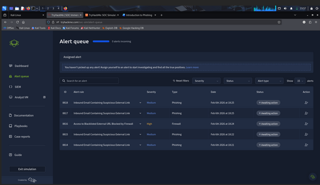
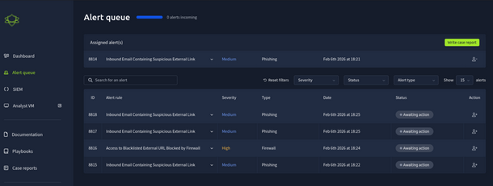
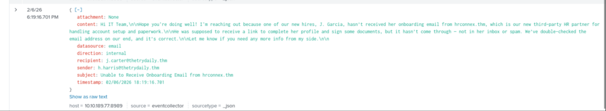
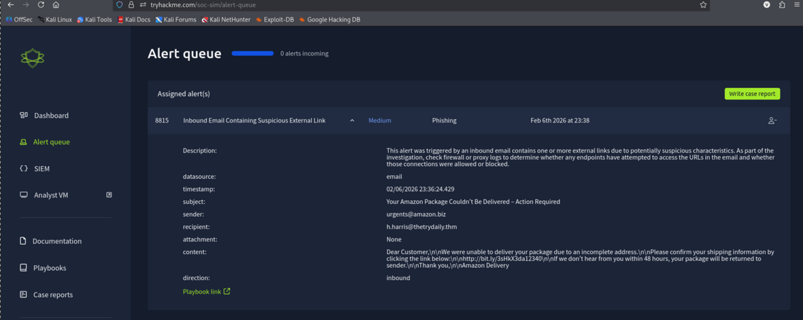
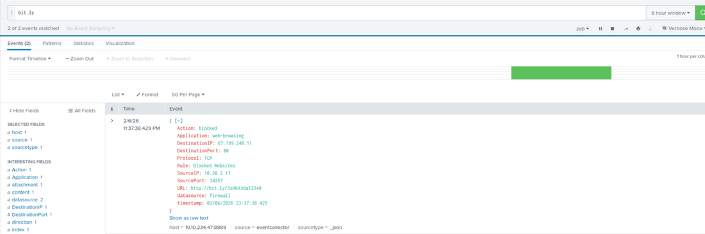

# SOC Simulator – Introduction to Phishing

## Overview
This project is a hands-on SOC simulator designed to introduce phishing attacks and 
their investigation from a Security Operations Center (SOC) perspective. The simulation 
focuses on analyzing phishing emails, validating alerts using SIEM data, classifying 
true and false positives, making escalation decisions, and documenting findings through 
incident reports.

## Objectives
- Understand common phishing techniques and indicators
- Analyze phishing alerts generated from email security systems
- Correlate email, firewall, and proxy logs using SIEM concepts
- Classify alerts as True Positive or False Positive
- Decide when escalation is required
- Practice writing professional SOC incident reports

## What You Will Learn
- Phishing email analysis
- Look-a-like domains and social engineering tactics
- URL investigation and link analysis
- SOC alert triage workflow
- Incident response documentation

## Target Audience
- SOC L1 / Junior Security Analysts
- Cybersecurity students and beginners
- Blue Team learners preparing for real-world SOC roles

## Simulation Scope
This simulator focuses on phishing-related alerts including:
- Inbound phishing emails
- Suspicious and shortened URLs
- Firewall and proxy blocks
- User interaction analysis
- Alert correlation across multiple data sources

There is currently **one alert** awaiting review.  
Additionally, **four more alerts** are expected shortly if you prefer to wait before proceeding.

## 8814 – Inbound Email Containing Suspicious External Link

## Description

This alert was triggered by an inbound email contains one or more external links due to potentially suspicious characteristics. As part of the investigation, check firewall or proxy logs to determine whether any endpoints have attempted to access the URLs in the email and whether those connections were allowed or blocked.

**datasource:** email  
**timestamp:** 11/20/2025 20:02:00.489  
**subject:** Action Required: Finalize Your Onboarding Profile  
**sender:** onboarding@hrconnex.thm  
**recipient:** j.garcia@thetrydaily.thm  
**attachment:** None  

## Email Content

Hi Ms. Garcia,Welcome to TheTryDaily! As part of your onboarding, please complete your final profile setup so we can configure your access. Kindly click the link below: \n\n<a href=”https://hrconnex.thm/onboarding/15400654060/j.garcia”>Set Up My Profile</a>.\n\nIf you have questions, please reach out to the HR Onboarding Team.

**Direction:** Inbound

## 8815 – Inbound Email Containing Suspicious External Link

**Description:**

This alert was triggered by an inbound email contains one or more external links due to potentially suspicious characteristics. As part of the investigation, check firewall or proxy logs to determine whether any endpoints have attempted to access the URLs in the email and whether those connections were allowed or blocked.

**datasource:** email  
**timestamp:** 11/20/2025 20:03:09.489  
**subject:** Your Amazon Package Couldn’t Be Delivered – Action Required  
**sender:** urgents@amazon.biz  
**recipient:** h.harris@thetrydaily.thm  
**attachment:** None  

**content:**

Dear Customer,We were unable to deliver your package due to an incomplete address.Please confirm your shipping information by clicking the link below:http://bit.ly/3sHkX3da12340If we don’t hear from you within 48 hours, your package will be returned to sender.Thank you,Amazon Delivery

**direction:** inbound

## REPORT

**Time of Activity:**  
02/06/2026 23:36:24

**List of Affected Entities:**  
- User: h.harris@thetrydaily.thm  
- Sender Email: urgents@amazon.biz  
- Spoofed Brand: Amazon  
- URL: http://bit.ly/3sHkX3da12340  
- Email System  
- Firewall / Proxy  

**Reason for Classifying as True Positive:**  
The email originated from a look-a-like Amazon domain (amazon.biz) rather than a legitimate Amazon domain. The message used social-engineering language related to package delivery and urged the user to click a shortened bit.ly link. SIEM and proxy logs confirmed that the user attempted to access the URL, which validates malicious user interaction. These indicators confirm the alert as a True Positive phishing attempt.

**Reason for Escalating the Alert:**  
No escalation required. The malicious URL access attempt was successfully blocked by the proxy/firewall, and no further compromise or payload execution was observed.

**Recommended Remediation Actions:**  
- Conduct user awareness training on identifying phishing emails and suspicious links.  
- Advise the user not to click on shortened or unexpected links.  
- Ensure email security controls continue blocking look-a-like domains and URL shorteners.  
- Monitor the user account for any unusual post-click activity as a precaution.

**List of Attack Indicators:**  
- Look-a-like sender domain (amazon.biz)  
- Social-engineering themed email (undelivered package)  
- Shortened external URL (bit.ly)  
- Urgent call-to-action language  
- Email from an unrecognized contact source

## 8816 – Access to Blacklisted External URL Blocked by Firewall

**Description:**

This alert was triggered when a user attempted to access an external URL that is listed in the organization’s blacklist or threat intelligence feeds. The firewall or proxy successfully blocked the outbound request, preventing the connection. Note: The blacklist only covers known threats. It does not guarantee protection against new or unknown malicious domains.

**datasource:** firewall  
**timestamp:** 11/20/2025 20:04:23.489  
**Action:** blocked  
**SourceIP:** 10.20.2.17  
**SourcePort:** 34257  
**DestinationIP:** 67.199.248.11  
**DestinationPort:** 80  
**URL:** http://bit.ly/3sHkX3da12340  
**Application:** web-browsing  
**Protocol:** TCP  
**Rule:** Blocked Websites

## REPORT

**Time of Activity:**  
11/20/2025 20:04:23 UTC  
(Based on firewall log timestamp)

**List of Affected Entities:**  
- User Endpoint IP: 10.20.2.17  
- User: h.harris@thetrydaily.thm  
- URL: http://bit.ly/3sHkX3da12340  
- Destination IP: 67.199.248.11  
- Firewall / Proxy  
- Threat Intelligence Blacklist  

**Reason for Classifying as True Positive:**  
The alert was triggered when a user attempted to access a URL that is already present in the organization’s blacklist and threat intelligence feeds. The URL is a shortened bit.ly link previously identified in a phishing email. The firewall successfully blocked the outbound connection, confirming a verified malicious access attempt and validating this as a True Positive.

**Reason for Escalating the Alert:**  
Although the connection was blocked, escalation is required to allow threat analysts to further investigate the underlying destination of the shortened URL and determine whether additional related domains, IP addresses, or indicators should be added to detection and blocking controls. Escalation also helps assess potential wider exposure across the environment.

**Recommended Remediation Actions:**  
- Escalate the incident to Threat Intelligence / SOC L2 team for deeper analysis.  
- Expand threat-hunting activities to identify any additional users who may have interacted with related URLs.  
- Review and update blacklist rules to include newly discovered indicators.  
- Reinforce user awareness regarding clicking shortened or suspicious links.

**List of Attack Indicators:**  
- URL present in threat intelligence blacklist  
- Shortened external link (bit.ly)  
- Firewall rule triggered: Blocked Websites  
- Outbound web-browsing attempt to known malicious destination  
- Correlation with prior phishing email incident

## 8817 – Inbound Email Containing Suspicious External Link

**Description:**

This alert was triggered by an inbound email contains one or more external links due to potentially suspicious characteristics. As part of the investigation, check firewall or proxy logs to determine whether any endpoints have attempted to access the URLs in the email and whether those connections were allowed or blocked.

**datasource:** email  
**timestamp:** 11/20/2025 20:05:27.489  
**subject:** Unusual Sign-In Activity on Your Microsoft Account  
**sender:** no-reply@m1crosoftsupport.co  
**recipient:** c.allen@thetrydaily.thm  
**attachment:** None  

**content:**

Hi C. Allen,

We detected an unusual sign-in attempt on your Microsoft account.

Location: Lagos, Nigeria  
IP Address: 102.89.222.143  
Date: 2025-01-24 06:42  

If this was not you, please secure your account immediately to avoid unauthorized access.

[Review Activity](https://m1crosoftsupport.co/login)

Thank you,  
Microsoft Account Security Team

**direction:** inbound

## REPORT

**Time of Activity:**  
02/06/2026 23:38:42 UTC  
(Based on email receipt timestamp)

**List of Affected Entities:**  
- User: c.allen@thetrydaily.thm  
- Sender Email: no-reply@m1crosoftsupport.co  
- Spoofed Brand: Microsoft  
- URL: https://m1crosoftsupport.co/login  
- Email Security System  

**Reason for Classifying as True Positive:**  
The inbound email impersonates Microsoft using a look-a-like domain (m1crosoftsupport.co) and attempts to create urgency by claiming an unusual sign-in from a foreign location. The email contains a login link intended to harvest user credentials. These indicators confirm the alert as a True Positive phishing attempt.

**Reason for Escalating the Alert:**  
No escalation required.  
No evidence was found of the user successfully accessing the phishing link or entering credentials.

**Recommended Remediation Actions:**  
- Educate the user on identifying phishing emails and fake login pages.  
- Advise the user to report similar emails immediately.  
- Block the sender domain at the email security gateway.  
- Continue monitoring the user account for suspicious activity.

**List of Attack Indicators:**  
- Look-a-like Microsoft domain (m1crosoftsupport.co)  
- Fake security alert with urgency  
- Credential-harvesting login link  
- Email from unrecognized external sender

## 8818 – Inbound Email Containing Suspicious External Link

**Description:**

This alert was triggered by an inbound email contains one or more external links due to potentially suspicious characteristics. As part of the investigation, check firewall or proxy logs to determine whether any endpoints have attempted to access the URLs in the email and whether those connections were allowed or blocked.

**datasource:** email  
**timestamp:** 11/20/2025 20:05:55.489  
**subject:** Action Required: Finalize Your Onboarding Profile  
**sender:** onboarding@hrconnex.thm  
**recipient:** j.garcia@thetrydaily.th  
**attachment:** None  

**content:**

Hi Ms. Garcia,

Welcome to TheTryDaily!

As part of your onboarding, please complete your final profile setup so we can configure your access.

Kindly click the link below:

[Set Up My Profile](

Another false positive. Similar to the first one.

Answer: No answer needed

